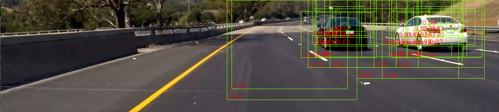
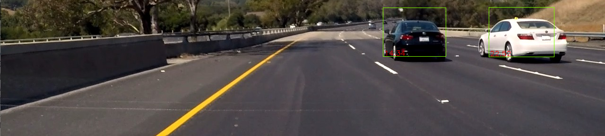

**Vehicle Detection Project**

The goals / steps of this project are the following:

* Perform a Histogram of Oriented Gradients (HOG) feature extraction on a labeled training set of images and train a Linear SVM classifier
* Optionally, you can also apply a color transform and append binned color features, as well as histograms of color, to your HOG feature vector. 
* Note: for those first two steps don't forget to normalize your features and randomize a selection for training and testing.
* Implement a sliding-window technique and use your trained classifier to search for vehicles in images.
* Run your pipeline on a video stream (start with the test_video.mp4 and later implement on full project_video.mp4) and create a heat map of recurring detections frame by frame to reject outliers and follow detected vehicles.
* Estimate a bounding box for vehicles detected.

## [Rubric](https://review.udacity.com/#!/rubrics/513/view) Points
### Here I will consider the rubric points individually and describe how I addressed each point in my implementation.  

---
### Writeup / README

#### 1. Provide a Writeup / README that includes all the rubric points and how you addressed each one.  You can submit your writeup as markdown or pdf.

This document is here: [https://github.com/balintfodor/CarND-Vehicle-Detection/blob/master/writeup.md](https://github.com/balintfodor/CarND-Vehicle-Detection/blob/master/writeup.md)

The final video is here: [https://youtu.be/83jDCytB8Ek](https://youtu.be/83jDCytB8Ek)

### Histogram of Oriented Gradients (HOG)

#### 1. Explain how (and identify where in your code) you extracted HOG features from the training images.

The projects exists basicly 4 files:

* `pipeline.py` - contains the program argument paramter parsing and routes the execution either to trainer.py or detector.py
* `trainer.py` - represents the training phase, collects the vehicle/non-vehicle sample images, preprocesses the (stores the preprocessed sample set in a file), builds an trains the classifier (and stores the classifier in a file)
* `detector.py` - represents the detection phase, loads the trained model from file, generates the sliding windows in several scales, calls the trainer for classification, merges the resulting overlapping windows and eliminates the potentially false positive ones
* `reader.py` - helper functions to load images from a folder or load image frames from a video

Feature extrection is implemented in `Trainer.image_to_feat_map` (`trainer.py`) which calls `Trainer._hist_map` and `Trainer._hog_map`. First the input image is converted to YUV colorspace. U and V channels are shifted with +0.5 to have their range in [0, 1].

Three HOG maps are generated based on all the channels (Y,U,V). The final parameters for the HOG are:

* `orientations = 11`
* `pixels_per_cell = (16, 16)`
* `cells_per_block = (2, 2)`
* `block_norm = 'L2-Hys'`
* `transform_sqrt = False`

The color histogram parameters are also extracted channel-by-channel. For a channel sliding windows of size `pixels_per_cell * cells_per_block` with step `pixels_per_cell` generated and the histogram is calculated. The final number of bins are `color_hist_bins = 17`. Note that the blocks for the color histogram generation matches the blocks used in the HOG map generation.

The histogram for a block is normalized using the L2-Hys method (`trainer.py:94`). Then the histogram values are sorted. Both the original histogram and the sorted one is stored in the feature vector. The idea behind the sorted histogram is to drop the notion of the exact values but enable the system to compare the ratio between the most populated bin and the second most populated one for example. It turned out the concatenating the sorted histogram to the feature vector raises the test accuracy.

So, as the HOG map and the color hist map has the same 2d dimensionality (but differs in the depth dimensionality) they can be stacked to form a 2d feature map. The final feature map is `NxMx336` (`336 = 2*2 * 11 * 3 + 2*2 * 17 * 3`, `2*2` for the block and `3` for the channels). Based on a `64x64` sample image a `3x3x336=3024` feature vector is generated.

In the training phase the sample vectors are collected the training set is feaure dimensions are scaled (`trainer.py:154`) with `StandaredScaler` (and its parameters are stored for use on the test set or in detection phase).

#### 2. Explain how you settled on your final choice of HOG parameters.

I tried a bunch of approaches with several parameters before getting to an acceptable result with this HOG-color hist feature generation. With a trial error method I found that choosing `16x16` for `pixels_per_cell` produces better result than `8x8`. Also I found that choosing `3x3` for `cells_per_block` don't give better results than `2x2`.

I also played with the other parameters like `block_norm` and `transform_sqrt`. L2-Hys performed the best for `block_norm`, and after converting the image into YUV `transform_sqrt` always generated 'invalid values' (NaN) warning, so I swithed it of. (Interestingly, using HSV it didn't generated the warning.)

#### 3. Describe how (and identify where in your code) you trained a classifier using your selected HOG features (and color features if you used them).

`trainer.py:170`

I tried several classifiers: SVC, LinearSVC, NuSVC, DecisionTreeClassifier, ExtraTreeClassifier, BaggingClassifier, AdaBoostClassifier, RandomForestClassifier, VotingClassifier.

I concluded with the followings:

* the quality and the type of the feature vectors is the most influential thing and a bad feature vectors can not be classified well no matter how complex classifier I use
* other then `LinearSVC` the classifiers run really slowly (on my computer) and has much more tunable parameters

Finally I chose `LinearSVC`. For the classification I wanted to have a [0,1] value to represent some kind of confidence. `LinearSVC` don't support it out of the box, so I used its `LinearSVC.decision_function` and put the value in a sigmoid function. Shifting the comparison from 0.5 I can tune the algorithm to be more permissive or strict when classifying low-confidence samples.

I chose a random fraction of 0.2 from the vehicle/non-vehicle samples to be the test set. The final accuracy measures:

* train acc= 0.999964808559
* **test acc= 0.989864864865**

### Sliding Window Search

#### 1. Describe how (and identify where in your code) you implemented a sliding window search.  How did you decide what scales to search and how much to overlap windows?

`detector.py:43`
`trainer.py:42`

First I drop the irrelevant parts of the image. It results in an `1280x288` wide image. I found out that scaling down with the fraction that goes from 1 to 1/4 in 8 steps gives a good result. So the sliding window search runs on 8 different scaled images. For scale a region is calculated to reduce the number of windows - for the smaller car (farther) detections only the upper part of the image is used, for the bigger car detections (closer) the whole `1280x288` image is used.

For every scaling a feature map generation is run resulting in an `NxMx336` feature map. The size of a training sample in *feature map dimensions* is stored at training phase. This is the size of the window we should slide through the feature map with. I chose step=1 since it is already means 16 pixels in the original image dimesnions.

For every window position a prediction value ([0, 1]) and a rect coordinate is given. I collect only the rectangles with higher than 0.5 prediction value and scale the coordinates back to match with the original image (1280x288) scale.

I also used asymetric scaling for the x and y dimensions to result search widows that are not squares but rectangles that maybe better suits for cars seen from side.

#### 2. Show some examples of test images to demonstrate how your pipeline is working.  What did you do to optimize the performance of your classifier?

The image below shows raw result of sliding window search for all the scales. The bottom left corder of the green rectangles show the confidence score for the detection. For optimizing the search I cropped the full sized image and restricted the searching are based on the image scaling.

After running `Detector._select_final_rois` (`detector.py:63`) the values show the accumulated confidence scores and the merged rectanges.

---

### Video Implementation

#### 1. Provide a link to your final video output.  Your pipeline should perform reasonably well on the entire project video (somewhat wobbly or unstable bounding boxes are ok as long as you are identifying the vehicles most of the time with minimal false positives.)

The final video is here: [https://youtu.be/83jDCytB8Ek](https://youtu.be/83jDCytB8Ek)

#### 2. Describe how (and identify where in your code) you implemented some kind of filter for false positives and some method for combining overlapping bounding boxes.

`detector.py:63`

Having search window positions from every scale I chose to use the overlapping window elimination method from the blog post [https://www.pyimagesearch.com/2015/02/16/faster-non-maximum-suppression-python/](https://www.pyimagesearch.com/2015/02/16/faster-non-maximum-suppression-python/). I had to modify the code but the basic idea seems elegant for me.

The overlapping threshold is 0.4 to merge the rectangles with. The merged windows accumulate the confidence score for the final window based on the original window prediction confidences. I filter out the final windows with lower than 3.0 accumulated score. The overlapping windows are also averaged in coordinates.

Seciton 2. contains the images showing example of the multiple window elimination.

---

### Discussion

#### 1. Briefly discuss any problems / issues you faced in your implementation of this project.  Where will your pipeline likely fail?  What could you do to make it more robust?

It took a lot of time for me to get acceptable results I am kind of satisfied with. The implementation of the system went quickly but playing with the parameters, the classifiers and trying different feature engineering approaches took long.

Tracking the windows frame-by-frame could give more confidence and smoothness for the detection.
